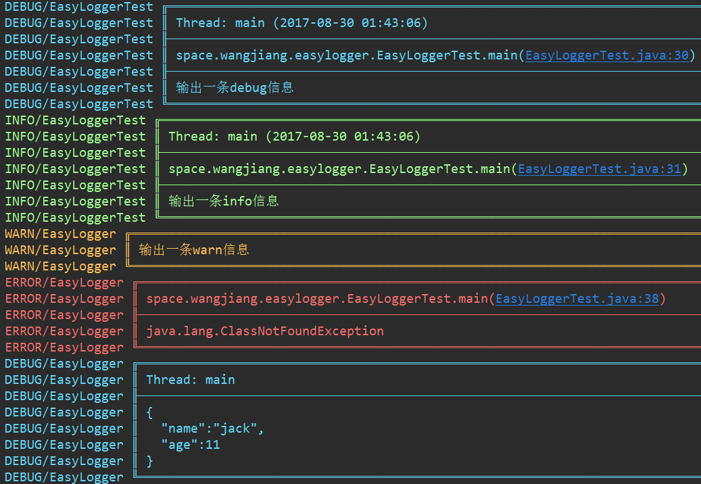
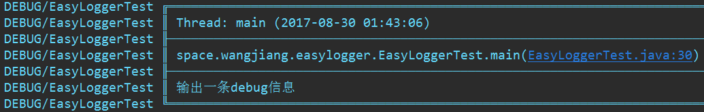
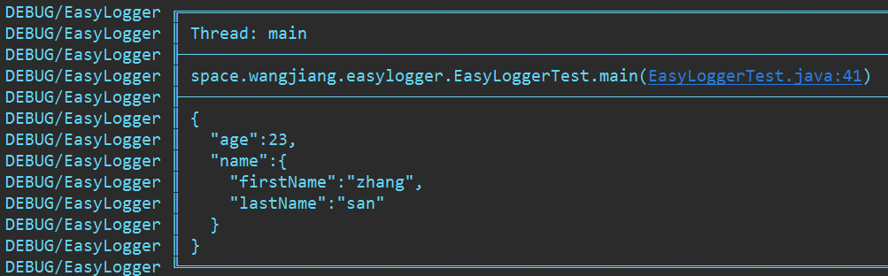
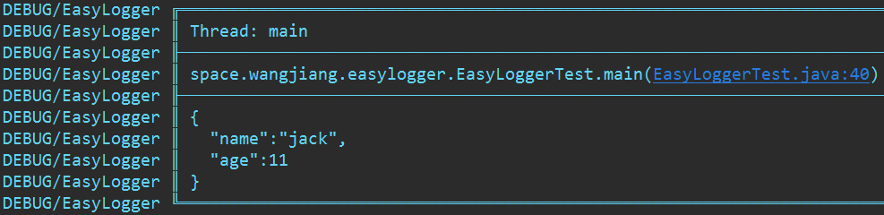
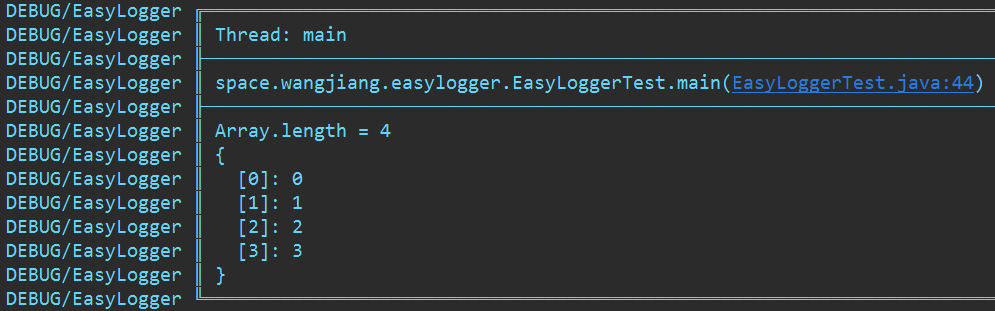
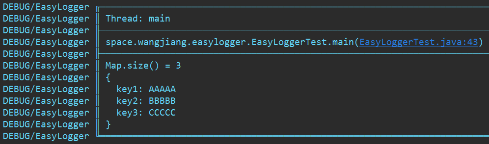

# EasyLogger

[](http://www.opensource.org/licenses/mit-license.php)

## 什么是EasyLogger
EasyLogger是一个日志工具，你可以用它替换掉代码中的```System.out.println()```，因为它更美观，也更方便
<div align="center">
	
</div>

> 控制台的颜色需要插件支持(例如IDEA的Grep Console)

## EasyLogger可以做什么
* 在控制台输出你的信息，并且提供美观的样式
* 自定义的配置，让输出的样式满足你的需求
* 格式化JSON字符串
* 格式化List、Map、Set等集合类
* 格式化数组

## 使用
输出一个debug信息
```java
EasyLogger.debug("输出一条debug信息");
```

<div align="center">
	
</div>

格式化JSON字符串
```java
EasyLogger.json("{\"age\":23,\"name\":{\"firstName\":\"zhang\",\"lastName\":\"san\"}} ");
```
<div align="center">
	
</div>

将对象转化为JSON字符串
```java
EasyLogger.json(new Person(11, "jack"));
```
<div align="center">
	
</div>

格式化数组
```java
EasyLogger.debug(new int[]{0, 1, 2, 3});
```
<div align="center">
	
</div>

格式化Map
```java
EasyLogger.debug(map);
```
<div align="center">
	
</div>

## 注意事项
项目上线前需要在项目入口调用```EasyLogger.closeLog()```来关闭日志输出

## 性能
EasyLogger是否会导致程序性能下降自然是需要考虑的，EasyLogger在打印的时候需要拼接大量字符串，底层调用了很多的System.out.println()，所以打印日志确实会消耗不少资源，但是关闭日志之后是否依旧会导致性能下降这个才是需要关注的重点

```java
EasyLogger.closeLog();
long start = System.currentTimeMillis();
for (int i = 0; i < 10000000; i++) {
    String pow = i + "的平方根是" + Math.pow(i, 0.5);
    String square = i + "的平方是" + Math.pow(i, 2);
    EasyLogger.debug(pow + "\n" + square);
}
System.out.println("耗时：" + (System.currentTimeMillis() - start));
```
运行上面的代码，会发现和完全不使用EasyLogger没有什么区别，实际上，debug、info等等调用的是printIDWE()这个方法，查看源码发现，第一行先判断是否打印日志，不打印的话直接返回，当关闭日志之后，EasyLogger基本上就不会消耗什么资源了

```java
private static void printIDWE(String msg, int level) {
    if (isClosed) return;
    //more code....
}
```

也就是说完全不需要担心EasyLogger会让你的程序变慢，当然你得在上线前关闭日志。这也和项目的定位有关，EasyLogger并不是想取代log4j之类的专业日志框架，它仅仅是想替换System.out.println()，在开发调试的时候，可以得到清晰的控制台输出。

## 开源协议
    The MIT License (MIT)

    Copyright (c) 2017 Wang-Jiang

    Permission is hereby granted, free of charge, to any person obtaining a copy
    of this software and associated documentation files (the "Software"), to deal
    in the Software without restriction, including without limitation the rights
    to use, copy, modify, merge, publish, distribute, sublicense, and/or sell
    copies of the Software, and to permit persons to whom the Software is
    furnished to do so, subject to the following conditions:

    The above copyright notice and this permission notice shall be included in all
    copies or substantial portions of the Software.

    THE SOFTWARE IS PROVIDED "AS IS", WITHOUT WARRANTY OF ANY KIND, EXPRESS OR
    IMPLIED, INCLUDING BUT NOT LIMITED TO THE WARRANTIES OF MERCHANTABILITY,
    FITNESS FOR A PARTICULAR PURPOSE AND NONINFRINGEMENT. IN NO EVENT SHALL THE
    AUTHORS OR COPYRIGHT HOLDERS BE LIABLE FOR ANY CLAIM, DAMAGES OR OTHER
    LIABILITY, WHETHER IN AN ACTION OF CONTRACT, TORT OR OTHERWISE, ARISING FROM,
    OUT OF OR IN CONNECTION WITH THE SOFTWARE OR THE USE OR OTHER DEALINGS IN THE
    SOFTWARE.